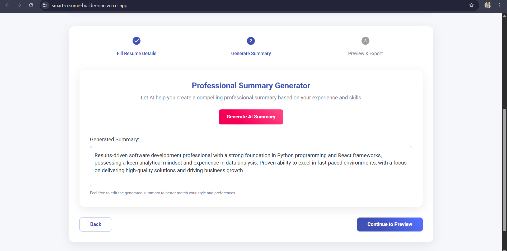
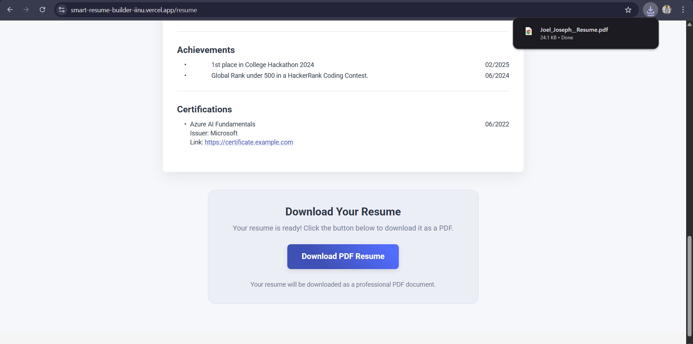

# Smart Resume Builder

A modern web application that helps users create professional resumes with AI assistance. This tool streamlines the resume creation process, generates professional summaries using AI, and produces well-formatted PDF documents.


## Application Screenshots

<table>
  <tr>
    <td></td>
    <td></td>
  </tr>
  <tr>
    <td></td>
    <td></td>
  </tr>
</table>

### Generated PDF


## Features

- **Step-by-Step Resume Creation**: Guided process for entering all resume details
- **AI-Powered Summary Generation**: Uses Groq API to create professional summaries
- **Comprehensive Resume Sections**:
  - Personal information with contact details
  - Professional summary (AI-generated or manually entered)
  - Work experience with company, position, dates, and descriptions
  - Education with institutions, degrees, and graduation dates
  - Skills displayed as bullet points
  - Projects with descriptions, technologies, and links
  - Achievements with dates
  - Certifications with issuers, dates, and links
- **Professional PDF Export**: Generate well-formatted, ATS-friendly PDF resumes
- **Interactive Preview**: See exactly how your resume will look before downloading
- **Modern UI**: Clean, responsive design with Material-UI components

## Project Structure

```
/smart-resume-builder
  /src
    /components
      ResumeForm.jsx       # Form for collecting resume details
      SummaryGenerator.jsx # AI-powered summary generation
      PDFExporter.jsx      # PDF generation and download
      SimplePDFExporter.jsx # Enhanced PDF exporter with hyperlinks
    /pages
      Home.jsx             # Main page with step-by-step process
      GeneratedResume.jsx  # Resume preview and export page
    /api
      openai.js            # Groq API integration (filename kept for compatibility)
    App.jsx                # Main application component
    theme.js              # Custom Material-UI theme
    index.js               # Entry point
```

## Getting Started

### Prerequisites

- Node.js (v14 or later)
- npm or yarn

### Installation

1. Clone the repository
   ```
   git clone https://github.com/yourusername/smart-resume-builder.git
   cd smart-resume-builder
   ```

2. Install dependencies:
   ```
   npm install
   ```
   
   Note: If you encounter dependency issues, use:
   ```
   npm install --legacy-peer-deps
   ```

3. Create a `.env` file in the root directory and add your Groq API key:
   ```
   REACT_APP_GROQ_API_KEY=your_groq_api_key_here
   ```
   
   Note: You can get a free API key from [Groq's console](https://console.groq.com/)

### Running the Application

```
npm start
```

The application will be available at http://localhost:3000

## How to Use

1. **Fill Resume Details**: Enter your personal information, work experience, education, skills, projects, achievements, and certifications.
2. **Generate Summary**: Use the AI-powered summary generator to create a professional summary based on your experience and skills.
3. **Preview & Export**: Review your resume and download it as a PDF.

## Technologies Used

- **React**: Frontend library for building the user interface
- **React Router**: For navigation between pages
- **Material-UI**: Component library for modern UI design
- **@react-pdf/renderer**: For generating PDF documents
- **Groq API**: For AI-powered summary generation
- **Custom Theme**: Enhanced styling with a custom Material-UI theme

## Future Enhancements

- Multiple resume templates to choose from
- Save and load resume data
- Direct sharing to LinkedIn and other platforms
- Additional language support
- More customization options for PDF output

## License

MIT

## Acknowledgments

- [Groq](https://groq.com/) for providing the AI API
- [Material-UI](https://mui.com/) for the component library
- [React-PDF](https://react-pdf.org/) for PDF generation capabilities
